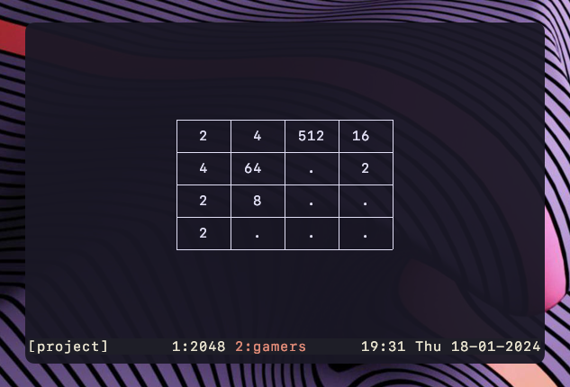

# :two::zero::four::eight: game in Rust

This is the well known game [2048](https://en.wikipedia.org/wiki/2048_(video_game)) written in [Rust](https://www.rust-lang.org) using [crossterm](https://docs.rs/crossterm/latest/crossterm/) so you can play it directly in your terminal.

<center></center>

## Try it yourself

- Clone this repository
```shell
git clone https://github.com/vieitesss/2048-rs.git
```
- Change the directory
```shell
cd 2048-rs
```
- Run
```shell
cargo run --release
```

## How to play

In order to win, you have to be able to merge the cells to get a 2048 cell (Not yet implemented). From there, you can freely continue the game infinitely, until it is impossible to move and you lose.

|                        Key                                                                   |           Function             |
|:--------------------------------------------------------------------------------------------:|:------------------------------:|
|<kbd>↑</kbd> <kbd>↓</kbd> <kbd>←</kbd> <kbd>→</kbd>                                           | shift matrix in that direction |
|<kbd>q</kbd> <kbd>Escape</kbd> <kbd>Shift</kbd> + <kbd>C</kbd> <kbd>Shift</kbd> + <kbd>D</kbd>| exit                           |

## TODO

In preference order:

- Winning with a 2048 cell
- Points (calculate and show)
- "Play again" option
- Saved user stats (max points, games played, ...)
- Show controls menu
