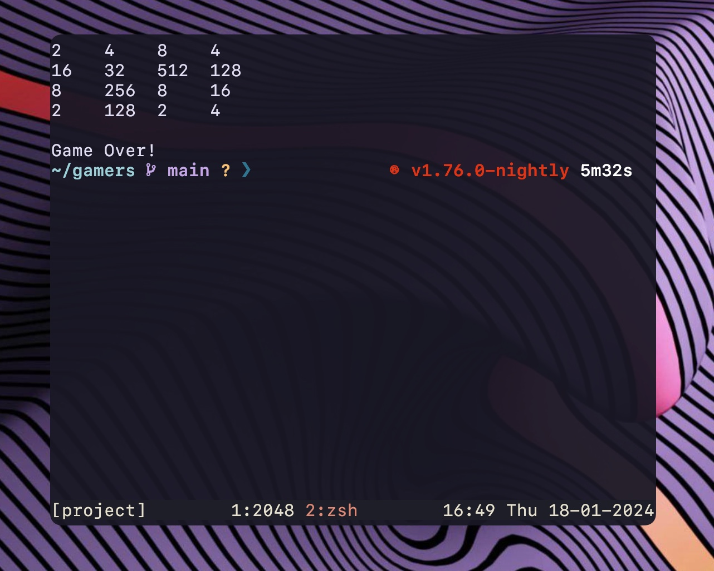

# :two::zero::four::eight: game in Rust

This is the well known game [2048](https://en.wikipedia.org/wiki/2048_(video_game)) written in [Rust](https://www.rust-lang.org) using [crossterm](https://docs.rs/crossterm/latest/crossterm/) so you can play it directly in your terminal.



## Try it yourself

- Clone this repository
```shell
git clone https://github.com/vieitesss/2048-rs.git
```
- Change the directory
```shell
cd 2048-rs
```
- Run
```shell
cargo run --release
```
